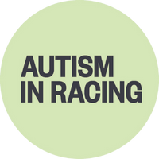
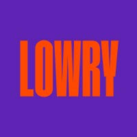
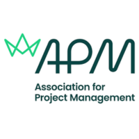
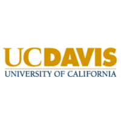

## Work Experience

<table class="resume-table">
  <thead>
    <tr>
      <th>Organisation</th>
      <th>Link</th>
      <th>Role</th>
      <th>Dates</th>
      <th>Location</th>
    </tr>
  </thead>
  <tbody>
    <tr>
      <td rowspan="2">
        
      </td>
      <td rowspan="2">
        <a href="https://www.autisminracing.com" target="_blank" rel="noopener">Autism in Racing</a>
      </td>
      <td>Freelance Marketing &amp; Fundraising Officer</td>
      <td>Oct 2025 – Present</td>
      <td rowspan="2">Hybrid UK</td>
    </tr>
    <tr>
      <td>Freelance Host </td>
      <td>Mar 2025 – Present</td>
    </tr>
    <tr>
      <td>
        
      </td>
      <td>
        <a href="https://danielklein.in/" target="_blank" rel="noopener">Daniel Klein</a>
      </td>
      <td>Marketing Manager</td>
      <td>Aug 2022 – Sep 2023</td>
      <td>Mumbai, India</td>
    </tr>
    <tr>
      <td>
        
      </td>
      <td>
        <a href="https://mdiamonds.in/" target="_blank" rel="noopener">M Diamonds</a>
      </td>
      <td>Freelance Concept Artist</td>
      <td>Jun 2020 – Sep 2020</td>
      <td>Kerala, India</td>
    </tr>
    <tr>
      <td>
        
      </td>
      <td>
        <a href="https://bitspace.co.in/" target="_blank" rel="noopener">Bitspace</a>
      </td>
      <td>Marketing Executive</td>
      <td>Nov 2018 – Jul 2022</td>
      <td>Navi Mumbai, India</td>
    </tr>
  </tbody>
</table>

## Additional Experience

<table class="resume-table">
  <thead>
    <tr>
      <th>Organisation</th>
      <th>Link</th>
      <th>Role</th>
      <th>Dates</th>
      <th>Location</th>
    </tr>
  </thead>
  <tbody>
    <tr>
      <td>
        
      </td>
      <td>
        <a href="https://www.autisminracing.com" target="_blank" rel="noopener">Autism in Racing</a>
      </td>
      <td>Host (Ad Hoc)</td>
      <td>Mar 2025 – Present</td>
      <td>UK</td>
    </tr>
    <tr>
      <td>
        
      </td>
      <td>
        <a href="https://thelowry.com/" target="_blank" rel="noopener">The Lowry: Beyond Van Gogh</a>
      </td>
      <td>Front of House (Ad Hoc)</td>
      <td>Jul 2024 – Oct 2024</td>
      <td>Birmingham, UK</td>
    </tr>
    <tr>
      <td>
        
      </td>
      <td>
        <a href="https://filmfreeway.com/FramesFilmFestival23" target="_blank" rel="noopener">Frames Film Festival</a>
      </td>
      <td>Chairperson</td>
      <td>Feb 2019 – Apr 2021</td>
      <td>Mumbai, India</td>
    </tr>
  </tbody>
</table>

## Education

<table class="resume-table">
  <thead>
    <tr>
      <th>Institution</th>
      <th>Link</th>
      <th>Degree</th>
      <th>Dates</th>
      <th>Location</th>
    </tr>
  </thead>
  <tbody>
    <tr>
      <td>
        
      </td>
      <td>
        <a href="https://www.mmu.ac.uk" target="_blank" rel="noopener">Manchester Metropolitan University</a>
      </td>
      <td>MSc Management (Strategy, Enterprise &amp; Sustainability)</td>
      <td>Jan 2024 – Jan 2025</td>
      <td>Manchester, UK</td>
    </tr>
  </tbody>
</table>

## Certifications

<table class="resume-table">
  <thead>
    <tr>
      <th>Issuer</th>
      <th>Link</th>
      <th>Certification</th>
    </tr>
  </thead>
  <tbody>
    <tr>
      <td>
        
      </td>
      <td>
        <a href="https://www.apm.org.uk" target="_blank" rel="noopener">Association for Project Management</a>
      </td>
      <td>APM Project Fundamentals Qualification (PFQ)</td>
    </tr>
    <tr>
      <td>
        
      </td>
      <td>
        <a href="https://www.ucdavis.edu" target="_blank" rel="noopener">University of California, Davis</a>
      </td>
      <td>The Strategy of Content Marketing</td>
    </tr>
  </tbody>
</table>

## Skills


 SEO strategy & technical audits 
 Website & CMS management (Shopify, UX optimisation) 
 Paid media & digital campaigns (Google Ads, email, influencer marketing) 
 Data analysis & reporting (Google Analytics, Power BI) 
 Content planning & copywriting 
 Stakeholder & team leadership 



 Tools: SEMrush, Ahrefs, Moz, Adobe Creative Suite, SimilarWeb, Trello 


